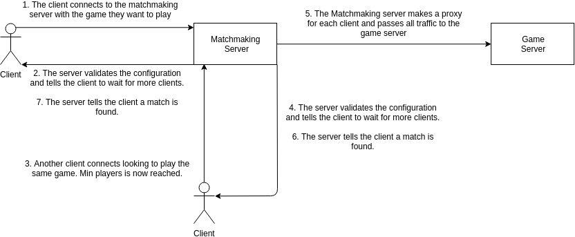
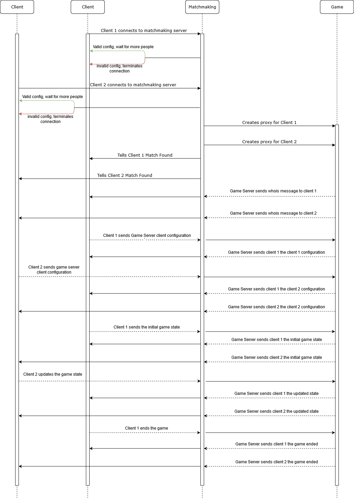
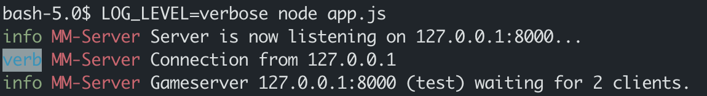
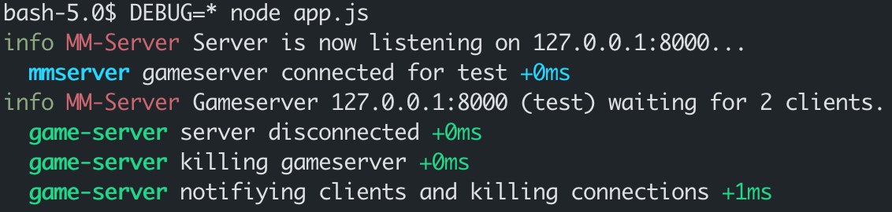
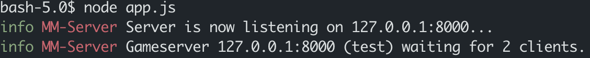

# gsnll (gozlab)

Welcome to gsnll, the best (and only) multiplayer game server system for 2019's spring CS 3100 class.
This README will provide instructions on how the game server functions,
how to run the server, and how you can integrate gsnll into your game to have
multiplayer functionality.

## Table of Contents

1. [Design](#design)
2. [Protocol](#protocol)
    1. [Connecting To the Matchmaking Server](#connecting-to-the-matchmaking-server)
    2. [Waiting For a Game](#waiting-for-game)
    3. [Initializing With the Game Server](#initializing-with-the-game-server)
    4. [Playing the Game](#playing-the-game)
3. [Running the Infrastructure](#running-the-infrastructure)
4. [Debugging the Matchmaking Server](#debugging-matchmaking-server)
5. [Running the Matchmaking Server in Production](#running-in-production)
6. [Appendix A: Matchmaking Server Messages](#matchmaking-server-messages)
7. [Appendix B: Game Server Messages](#game-server-messages)
8. [Appendix C: Supplementary Functions](#supplementary-functions)

## Design

gsnll is designed with two main components:
1. **Matchmaking Server** (mm) - The Matchmaking Server is what the client
   connects to when it wants to play a game.
   The server determines if there is a game server that will run a particular game
   and manages the lobbies for the different games. (i.e. if two
   people want to play `gofish`, they will be matched to each other)
2. **Game Server** (gs) - The Game Server handles some of the logic of the
   game and all clients with the state of the game. The Game Server only
   supports turn based games (one client goes, sends a message to all other
   clients, then the next player takes their turn).

An example matchmaking flow is as follows:



An example flow of an entire game is as follows:



## Protocol

This section describes the protocol that the matchmaking server and game
server use to communicate with the client. All messages are JSON sent over
TCP through a low level socket interface. Examples below will be written
using python; however, the concepts should apply to all languages.

A generic message looks like:

```json
{
    "messageType": <THE_MESSAGE_TYPE>,
    "data": <JSON_CONTAINING_DATA_BASED_ON_TYPE>
}
```

This section will document all of the different message types with their
associated data and the responses to those messages.

| type          | data                                | Who Sends? | response                             | Who Sends? |
| ------------- | ----------------------------------- | ---------- | ------------------------------------ | ---------- |
| connection    | [ConnectionData](#connectiondata)   | client     | [response](#connectiondata-response) | server     |
| connect       | [ConnectionFound](#connectionfound) | server     | N/A                                  | N/A        |
| whois         | [WHOIS](#whois)                     | server     | [response](#clientinfo)              | client     |
| client-info   | [ClientInfo](#clientinfo)           | client     | [response](#clientinfo-response)     | server     |
| client-list   | [ClientList](#clientlist)           | client     | [response](#clientlist-response)     | server     |
| game-state    | [PushGameState](#pushgamestate)     | client     | [response](#pushgamestate-response)  | server     |
| game-finished | [GameFinished](#gamefinished)       | client     | [response](#gamefinished-response)   | server     |
| disconnect    | [Disconnect](#disconnect)           | server     | N/A                                  | N/A        |
| random-data   | [RandomData](#randomdata)           | client     | [response](#randomdata-response)     | server     |
| error         | [Error](#error) (also a response)   | server     | N/A                                  | N/A        |

### Connecting to the Matchmaking Server

The first step of the protocol is creating a TCP connection the matchmaking
server. We currently do not provide an official matchmaking server to connect to,
so follow the instructions in [Running the
infrastructure](#running-the-infrastructure) to set one up. The server will print
the IP and port is it listening on.

Creating a socket connection to the matchmaking server:

```python
import socket

HOST = '127.0.0.1'
PORT = 8000

with socket.socket(socket.AF_INET, socket.SOCK_STREAM) as s:
    # Connect to matchmaking server
    s.connect((HOST, PORT))
```

The client then needs to tell the matchmaking server what game it would like to
play and the identifier (team name) of the client. This will allow the
Matchmaking Server to connect the client with the correct Game Server and the
Game Server to distinguish the clients from each other.

The connection messages sent to the Matchmaking Server look like:

```json
{
    "messageType": "connect",
    "data": {
        "game": <GAME_NAME:string>,
        "clientType": "client",
        "configuration": {
            "id": <THE_ID_OF_THE_PLAYER:string>,
        }
    }
}
```

With a full example this will look like:

```python
import json
import socket

HOST = '127.0.0.1'
PORT = 8000
player_id = "test"
game = "default"

with socket.socket(socket.AF_INET, socket.SOCK_STREAM) as s:
    # Connect to matchmaking server
    s.connect((HOST, PORT))

    # Send client connection message to the matchmaking server
    payload = json.dumps({
        "messageType": "connect",
        "data": {
            "game": game,
            "clientType": "client",
            "configuration": {
                "id": player_id
            }
        }
    })
    print("response", send_json(s, payload))
```

The `send_json()` function is provided
[at the end of this README](#supplementary-functions).

The potential responses from the server are
documented [here](#connectiondata-response).

You can then parse this response from the server to determine if your message is
valid and you can continue to the next stage.

### Waiting for Game

Now, your client must wait for the matchmaking server to notify you that a game
is ready. The matchmaking server follows four rules when determining whether to
tell a client that a match has been found:
1. Is the current number of clients connected greater than the minimum players
   to play the game? If yes, start a 30 second timer to allow more clients to
   connect to the match.
2. Is the current number of clients connected equal to the maximum players to
   play the game? If yes, immediately tell all clients that a game has been
   found.
3. Is the current number of clients connected greater than the minimum players
   AND has the timer for more players expired? If yes, immediately tell all
   clients that a game has been found.
4. Is the current number of clients connected less than the minimum players AND
   the timer for more players has expired? If yes, wait for more players to connect
   to the game.

This can be received synchronously in python by using `game =
socket.recv(1024)`. `Game` will then be the next message that the server sends
to the client. The client will only receive a connection when a match has been
successfully found. The message is documented [here](#connectionfound).

After this message is received, your client will be transparently proxied to the
game server. This means that all future messages you send to the Matchmaking
Server will be sent directly to the Game Server instead.

### Initializing with the Game Server

Now that you are proxied to the game server, you need to send the game server
some information about you. When you first connect, the Game Server will send
you a WHOIS message that looks like [this](#whois). Your client should respond
by sending information about itself with a message that looks like
[this](#clientinfo). When the Game Server receives the message, it will switch
your client to a 'ready' state. The response to this message will be broadcasted
to all clients connected to the server. It looks like [this](#clientinfo-response). You
may send this message at any time while playing if you would like to update your
client's information.

All clients connected must be in the 'ready' state before you can begin the
game. When all clients are ready, you must then send the initial game state.
It is recommended that the 'lobby leader' sends this message which looks like
[this](#pushgamestate). The 'lobby leader' is by default the first player to
queue up for a game.  If this player leaves the lobby, the player who queued up
immediately after the former lobby leader is promoted.

The response to this message will also broadcasted to all clients and looks
like [this](#pushgamestate-response).

A complete example that runs through all of these steps from the beginning:

```python
import json
import socket

HOST = '127.0.0.1'
PORT = 8000
player_id = "test"
game = "default"

with socket.socket(socket.AF_INET, socket.SOCK_STREAM) as s:
    # Connect to matchmaking server
    s.connect((HOST, PORT))

    # Send client connection message to the matchmaking server
    payload = json.dumps({
        "messageType": "connect",
        "data": {
            "game": game,
            "clientType": "client",
            "configuration": {
                "id": player_id
            }
        }
    })
    print("response", send_json(s, payload))

    print('Telling the game server I am ready')
    game_connect_payload = json.dumps({
        "messageType": "client-info",
        "data": {
            "clientInfo": {
                "id": player_id
            }
        }
    })

    print("response", send_json(s, game_connect_payload))

    # Wait for other clients to connect
    # Note: You might want to monitor client-info messages
    #       to keep track of the number of connected players
    time.sleep(1)

    print('Sending the initial state')
    game_state_payload = json.dumps({
        "messageType": "game-state",
        "data": {
            "state": {
                "my_id": player_id
            }
        }
    })
    print("response", send_json(s, game_state_payload))
```

The `send_json()` function is provided
[at the end of this README](#supplementary-functions).

### Playing the Game

To play the game, simply make a move locally on your client and then update the
overall game state with the following message structure:

```json
{
    "messageType": "game-state",
    "data": {
        "state": <STATE_INFO_NECESSARY_FOR_YOUR_GAME:json>
    }
}
```

The response will be broadcasted to all players. When they receive this
message, they can take their turn and the update the state. This cycle will
continue until the game is over. To end the game, send the following message to
the server:

```json
{
    "messageType": "game-finished"
}
```

The response will be broadcast to all clients and will look like
[this](#game-finished-response). When a client receives this message, they should
then disconnect from the server and do whatever client side display of who won
/ lost.

The Game Server will send a [disconnect message](#disconnect-response)
whenever your client should disconnect from it. This will be sent whenever an
unrecoverable error occurs or directly after the game finishes. You may
choose to disconnect only when this message is received instead of
disconnecting when the game finishes.

A naive full implementation of all steps:

```python
import json
import socket

HOST = '127.0.0.1'
PORT = 8000
player_id = "test"
game = "default"

with socket.socket(socket.AF_INET, socket.SOCK_STREAM) as s:
    # Connect to matchmaking server
    s.connect((HOST, PORT))

    # Send client connection message to the matchmaking server
    payload = json.dumps({
        "messageType": "connect",
        "data": {
            "game": game,
            "clientType": "client",
            "configuration": {
                "id": player_id
            }
        }
    })
    print("response", send_json(s, payload))

    print('Telling the game server I am ready')
    game_connect_payload = json.dumps({
        "messageType": "client-info",
        "data": {
            "clientInfo": {
                "id": player_id
            }
        }
    })

    print("response", send_json(s, game_connect_payload))

    # Wait for other client to connect
    time.sleep(1)

    print('Sending the initial state')
    game_state_payload = json.dumps({
        "messageType": "game-state",
        "data": {
            "state": {
                "my_id": player_id
            }
        }
    })
    print("response", send_json(s, game_state_payload))

    print('Updating a new state')
    game_state_payload = json.dumps({
        "messageType": "game-state",
        "data": {
            "state": {
                "turn": "2"
            }
        }
    })
    print("response", send_json(s, game_state_payload))


    print('Ending the game')
    game_state_payload = json.dumps({
        "messageType": "game-finished",
    })
    print("response", send_json(s, game_state_payload))
```

The `send_json()` function is provided
[at the end of this README](#supplementary-functions).

A full game example can be found in the chat client.

## Running the infrastructure

If you would like to run the infrastructure yourself, please follow the steps
below:
1. Download [nodejs](https://nodejs.org/en/) LTS or later.
2. (**optional**) Download [yarn](https://yarnpkg.com/en/docs/install). You
   may choose to use npm instead, but we only officially support yarn.
3. Clone this repository.
4. Open two terminals and do each action below in only one terminal:
    1. Terminal 1
        1. `cd` into the `matchmaking/` directory located in the repository
        2. run the following commands:
            ```bash
            # Using Windows CMD or PowerShell
            yarn install && yarn build && node ./build/src/app.js
            # Using Git Bash or Linux
            yarn install && yarn start:dev

            # alternatively
            npm install && npm run start:dev
            ```
    2. Terminal 2
        1. `cd` into the `game-server/` directory located in the repository
        2. run the following command:
            ```bash
            # Using Windows CMD or PowerShell
            yarn install && yarn build && node build/src/main.js
            # Using Git Bash or Linux
            yarn install && yarn start:dev

            # alternatively
            npm install && npm run start:dev
            ```

**NOTE**: you **MUST** run the start command in the matchmaking directory
*before* the game-server directory otherwise the game server will fail to connect.

You now have a fully working game-server and matchmaking server. The default
game name is `default` and will allow any arbitrary state to be passed through
it. If that doesn't make sense yet, continue below for an explanation of client
integration.

## Debugging Matchmaking Server

If you are running the server for development or debugging use, or encounter an error, a good way to try and solve your problem is to enable debug mode.
To do this, there are two levels. The first will enable more output on new connections and just useful info:

```bash
LOG_LEVEL=verbose yarn start:dev
```

This will result in output that looks like below:



The second option will dramatically expand debugging features, show you how long commands are taking, and bloat the terminal, but with useful information:

```bash
DEBUG=* yarn start:dev
```
>NOTE: using DEBUG=* with the development server will add additional
>output at first. I recommend doing the steps below in [Running in
>Production](#running-in-production) and using debug on the build version instead.

This will result in output that looks like below:



For reference, this is what the server outputs with no debug levels:



These can both be enabled simultaneously:

```bash
LOG_LEVEL=verbose DEBUG=* yarn start:dev
```

## Running in Production

To run it production, not much has to change. The commands to build and run the server for production are:

```bash
 # Generates the production executable
yarn build

# Starts the server
node build/src/app.js
```

## Matchmaking Server Messages

### ConnectionData

```json
{
    "messageType": "connect",
    "data": {
        "game": <GAME_NAME:string>,
        "clientType": "client",
        "configuration": {
            "id": <THE_ID_OF_THE_PLAYER:string>,
        }
    }
}
```

#### ConnectionData Response

On success:

```json
{
  "messageType": "response",
  "data": {
    "message": "Valid configuration found. Please wait for connection.",
  }
}
```

On bad configuration:

```json
{
  "messageType": "error",
  "data": {
    "errorType": "INVALID_CONFIG",
    "message": "Invalid configuration.",
  }
}
```

When no servers exist for the game:

```json
{
  "messageType": "error",
  "data": {
    "errorType": "NO_SERVERS_EXIST",
    "message": "No servers are currently available for your game.",
  }
}
```

### ConnectionFound

```json
{
    "messageType": "connect",
    "data": {
      "message": "Match Found!",
    }
}
```

## Game Server Messages

### WHOIS

Received when connecting to the Game Server.

```json
{
    "messageType": "whois",
    "data": {
        "id": <CLIENT_INDEX:number>
    }
}
```

### ClientInfo

```json
{
    "messageType": "client-info",
    "data": {
        "clientInfo": <CLIENT_INFO_NECESSARY_FOR_YOUR_GAME>
    }
}
```

#### ClientInfo Response

On success, sent to all players:

```json
{
    "messageType": "client-info",
    "data": {
        "clientInfo": <CLIENT_INFO_NECESSARY_FOR_YOUR_GAME>
    }
}
```

On bad clientInfo:

```json
{
    "messageType": "error",
    "data": {
        "reason": "invalid client information format",
        "message": <FRIENDLY_ERROR_MESSAGE:string>,
        "state": <CURRENT_GAME_STATE>
    }
}
```

### PushGameState

```json
{
    "messageType": "game-state",
    "data": {
        "state": <STATE_INFO_NECESSARY_FOR_YOUR_GAME>
    }
}
```

#### PushGameState Response

Will be returned and sent to all players.

```json
{
    "messageType": "game-state",
    "data": {
        "state": <STATE_INFO_NECESSARY_FOR_YOUR_GAME>
        "lobbyLeader": <LOBBY_LEADER_INDEX:number>
    }
}
```

### GameFinished

```json
{
    "messageType": "game-finished"
}
```

#### GameFinished Response

Will be returned and set to all players.

```json
{
    "messageType": "game-finished",
    "data": { }
}
```

### Disconnect

Received whenever a client should close its connection to the server.

```json
{
    "messageType": "disconnect",
    "data": { }
}
```

### ClientList

Requests a list of all the clients connected to the server that are ready/playing.

```json
{
    "messageType": "client-list"
}
```

#### ClientList Response

```json
{
    "messageType": "client-list",
    "data": {
        "id": <CLIENT_INDEX:number>,
        "clientInfo": <CLIENT_INFO_NECESSARY_FOR_YOUR_GAME>,
        "isLobbyLeader": <WHETHER_CLIENT_IS_LOBBY_LEADER:boolean>
    }[]
}
```

### ClientDisconnected

Received whenever a client disconnects.

```json
{
   "messageType": "client-disconnected",
   "data": {
       "id": <CLIENT_INDEX:number>,
       "clientInfo": <CLIENT_INFO_NECESSARY_FOR_YOUR_GAME>
   }
}
```

### RandomData

Used for broadcasting random data to all the players.

```json
{
    "messageType": "random-data",
    "data": <ANYTHING>
}
```

#### RandomData Response

```json
{
    "messageType": "random-data",
    "data": <ANYTHING>
}
```

### Error

Received as a response to invalid messages and whenever an error occurs.

```json
{
    "messageType": "error",
    "data": {
        "reason": <STANDARD_ERROR_REASON:ErrorReason>,
        "message": <FRIENDLY_ERROR_MESSAGE:string>,
        "state": <STATE_INFO_NECESSARY_FOR_YOUR_GAME>
    }
}
```

## Supplementary Functions

### JSON receive wrapper

```python
def recv_json(server_socket):
    header = server_socket.recv(8)
    size = unpack('<I', header[4:8])[0]
    if not(header.startswith(b"JSON")):
        raise "Invalid JSON format (Missive)"
    if size < 0 or size > 1024 * 1024:
        raise "Incoming JSON is too large: " + str(size)
    # read incoming size from socket, then remove the trailing newline
    body = server_socket.recv(size)[:-1]
    # parse into json
    return json.loads(body)
```

### JSON send wrapper

```python
def send_json(server_socket, msg_payload):
    if msg_payload[-1] != "\n":
        msg_payload += "\n"
    prefix = "JSON".encode("utf-8")
    size = pack("<I", len(msg_payload))
    message = msg_payload.encode("utf-8")
    server_socket.sendall(prefix + size + message)

    return recv_json(server_socket)
```
